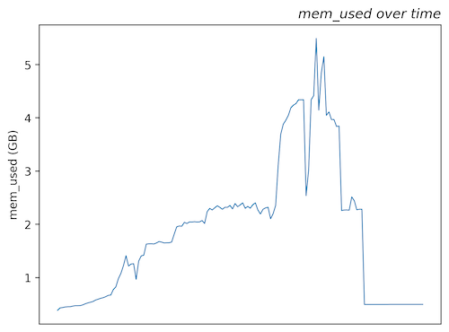

# Features

The tool can generate multiple outputs, depending on the options specified. Generally, they can be classified as: [console output](#console-output) and [output files](#output-files).

## Console output

Always generated.

### Table

A table printed to the console, which can be used for visual inspection of the metrics collected.

```console
┏━━━━━━━━━━━━┳━━━━━━━━━━━━┓
┃ Time (UTC) ┃ Value      ┃
┡━━━━━━━━━━━━╇━━━━━━━━━━━━┩
│  19:17:30  │ 469.113 MB │
│  19:17:00  │ 1.721 GB   │
│  19:16:30  │ 6.230 GB   │
│  19:16:00  │ 7.428 GB   │
│  19:15:30  │ 2.417 GB   │
│  19:15:00  │ 2.752 GB   │
│  19:14:30  │ 2.836 GB   │
│  19:14:00  │ 1.348 GB   │
│  19:13:30  │ 772.855 MB │
└────────────┴────────────┘
```

### Summary message

A summary message is printed to the console:

```console
Max 'memory_usage' is 6.23 GB over 1:03:00 timespan
```

### Uptime

A summary message with the uptime of the instance in seconds. It's either calculated precisely if the instance is running, or estimated based on the reported metrics over at least 15 days. If a longer period of time is desired, please use the `--days` option.

```console
Instance uptime is 72886 seconds
```

## Output files

Generated when `--save` option is used.

### JSON with reponse

A JSON file with the response from the AWS API, useful for debugging.

```json title="{instance_id}_response.json"
{
  "MetricDataResults": [
    {
      "Id": "memory_usage",
      "Label": "mem_used",
      "Values": [
        492003328.0, 492204032.0, 492040192.0, 450666496.0, 429965312.0
      ],
      "Timestamps": [
        "2021-11-12 19:19:00+00:00",
        "2021-11-12 19:18:30+00:00",
        "2021-11-12 19:18:00+00:00",
        "2021-11-12 19:12:00+00:00",
        "2021-11-12 19:11:30+00:00"
      ],
      "StatusCode": "Complete"
    }
  ],
  "Messages": [],
  "ResponseMetadata": {
    "RequestId": "f603ff23-a3d3-43a7-b3b3-65106445a9ed",
    "HTTPStatusCode": 200,
    "HTTPHeaders": {
      "x-amzn-requestid": "f603ff23-a3d3-43a7-b3b3-65106445a9ed",
      "content-type": "text/xml",
      "content-length": "1954",
      "date": "Fri, 12 Nov 2021 22:05:42 GMT"
    },
    "RetryAttempts": 0
  }
}
```

### JSON with metric data

A JSON file with the raw data, which can be used for further analysis.

```json title="{instance_id}_{metric_label}.json"
{
  "Label": "mem_used",
  "Values": [492003328.0, 492204032.0, 492040192.0, 450666496.0, 429965312.0],
  "Timestamps": [
    "2021-11-12 19:19:00+00:00",
    "2021-11-12 19:18:30+00:00",
    "2021-11-12 19:18:00+00:00",
    "2021-11-12 19:12:00+00:00",
    "2021-11-12 19:11:30+00:00"
  ]
}
```

### CSV with metric data


A CSV file with the raw data, which can be used for further analysis.

``` title="{instance_id}_{metric_label}.csv"
time,value
2021-11-12 19:19:00+00:00,492003328.0
2021-11-12 19:18:30+00:00,492204032.0
2021-11-12 19:18:00+00:00,492040192.0
2021-11-12 19:12:00+00:00,450666496.0
2021-11-12 19:11:30+00:00,429965312.0
```

### Plot with metric data

Generated when `--plot` option used.

<figure markdown>
  
  <figcaption><code>{instance_id}_{metric_label}.png</code></figcaption>
</figure>
